# Buyout Game Benchmark: Multi-Agent Bargaining, Transfers, and Hostile Takeovers

This benchmark measures long-horizon social strategy under explicit financial incentives. Eight models play a multi-round elimination game with unequal starting balances, a public prize ladder, private transfers, public votes, and a finalist-only endgame where the last two seats can negotiate, settle, or buy each other out.

The canonical outcome is **final wealth**, not raw finish order. A model can reach the end, take 1st place in the finale, and still lose on money. That is the central design choice: the benchmark rewards models that manage incentives, alliances, spending, and endgame leverage well across many games, not just models that survive the longest.

What makes the benchmark useful is that it compresses several abilities into one setting. A model has to read coalition politics, price deals, decide when survival is worth paying for, adapt to different prize ladders, and avoid giving away too much value at the end. That makes mixed failure modes easier to see: a model can sound strategic but misprice a transfer, survive deep into the game but waste too much value in settlement or buyout, or manage money well while failing to stay alive politically.

---

## At A Glance

Each game:

- seats **8 models**
- starts from a fixed **800**-coin pot
- guarantees each seat **10** coins, then splits the remaining **720** with a controlled unequal random draw
- announces one of **9** public prize ladders formed by combining **3** total-pool sizes with **3** payout shapes
- runs **6 elimination rounds**
- ends with a special finalist-controlled buyout phase plus a bounded jury bonus

Current canonical variant:

- **balances are public**
- **transfers are private**
- **elimination votes are public**
- **final wealth is the canonical score**
- **public ratings use mirrored 2-game match packs**

---

## Main Leaderboard

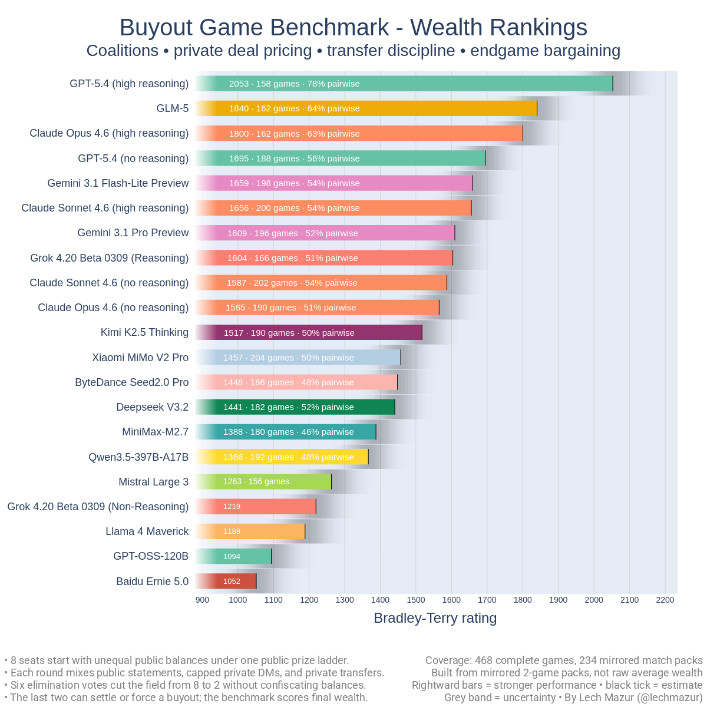

This is the headline ranking for the current public snapshot. The published order uses **Bradley-Terry** over wealth-based pairwise results from complete mirrored match packs.

| Rank | Model | BT | Games | Match Packs |
| ---: | --- | ---: | ---: | ---: |
| 1 | GPT-5.4 (high reasoning) | 2052.8 | 158 | 79 |
| 2 | GLM-5 | 1840.2 | 162 | 81 |
| 3 | Claude Opus 4.6 (high reasoning) | 1800.3 | 162 | 81 |
| 4 | GPT-5.4 (no reasoning) | 1694.8 | 188 | 94 |
| 5 | Gemini 3.1 Flash-Lite Preview | 1659.3 | 198 | 99 |
| 6 | Claude Sonnet 4.6 (high reasoning) | 1655.5 | 200 | 100 |
| 7 | Gemini 3.1 Pro Preview | 1609.1 | 196 | 98 |
| 8 | Grok 4.20 Beta 0309 (Reasoning) | 1603.6 | 166 | 83 |
| 9 | Claude Sonnet 4.6 (no reasoning) | 1587.0 | 202 | 101 |
| 10 | Claude Opus 4.6 (no reasoning) | 1565.1 | 190 | 95 |
| 11 | Kimi K2.5 Thinking | 1517.0 | 190 | 95 |
| 12 | Xiaomi MiMo V2 Pro | 1457.0 | 204 | 102 |
| 13 | ByteDance Seed2.0 Pro | 1448.1 | 186 | 93 |
| 14 | Deepseek V3.2 | 1440.5 | 182 | 91 |
| 15 | MiniMax-M2.7 | 1387.7 | 180 | 90 |
| 16 | Qwen3.5-397B-A17B | 1366.3 | 192 | 96 |
| 17 | Mistral Large 3 | 1262.6 | 156 | 78 |
| 18 | Grok 4.20 Beta 0309 (Non-Reasoning) | 1219.1 | 158 | 79 |
| 19 | Llama 4 Maverick | 1188.6 | 158 | 79 |
| 20 | GPT-OSS-120B | 1093.8 | 158 | 79 |
| 21 | Baidu Ernie 5.0 | 1051.6 | 158 | 79 |

---

## How To Read The Main Chart

- Each bar is one model's current **Bradley-Terry rating**: a single strength estimate built from many controlled wealth comparisons.
- Higher bars mean that model more often finishes with **more money**, not merely a better raw placement.
- The gray band is an uncertainty envelope around the estimated rating.
- `Games` counts completed underlying games; `Match Packs` counts the mirrored 2-game units that actually update the public rating.
- A **match pack** is the benchmark's canonical rating unit: two linked games with the same lineup, same prize regime, and same starting-balance multiset.
- Across those two games, seat assignments are permuted so models see mirrored rich/poor balance-rank exposure, and public speaking-order exposure is balanced across the linked rounds.
- Only complete mirrored match packs update the public board. Standalone debug or ad hoc games do not.

---

## Current Snapshot

- **21 rated models**
- **468 complete games**
- **234 mirrored 2-game match packs**, which are the canonical public rating units
- **8 seats per game**
- **public balances, private transfers, public elimination votes**
- **9 public prize ladders** built from three prize-pool sizes and three payout shapes: `ultra_top_heavy`, `top_heavy`, and `moderate`

---

## Pairwise View

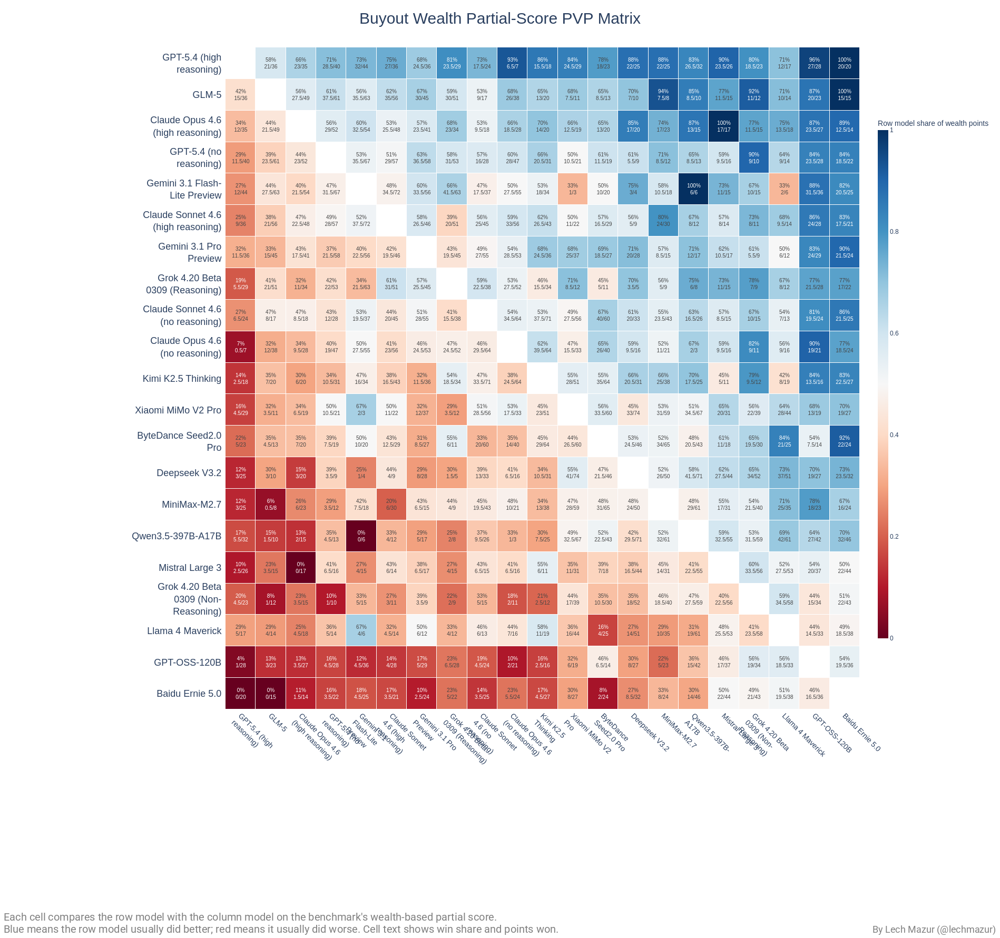

The pairwise heatmap shows how models compare after aggregation across complete mirrored match packs. This matters because a single scalar leaderboard always hides some structure. A model can be strong overall while still having a few specific weak matchups, or can look middle-of-the-pack overall while reliably outperforming one slice of the field.

---

## Other Diagnostics

The public leaderboard is Bradley-Terry. The charts below help explain **how** models are winning or losing.

### Average Final Wealth

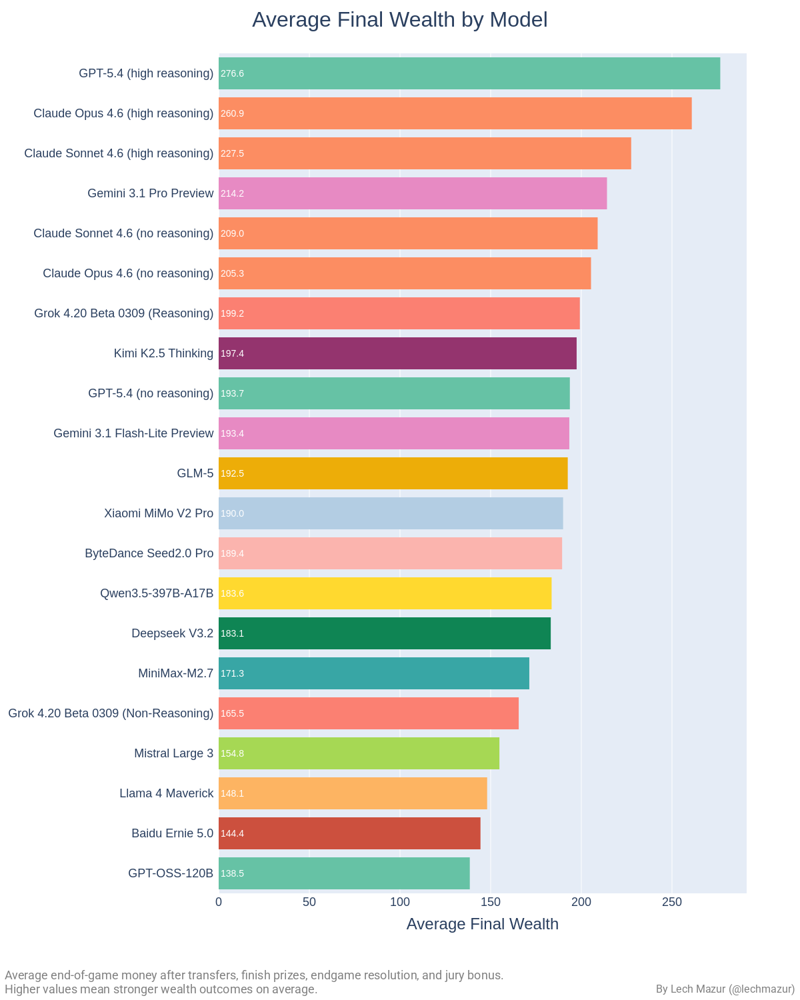

This is the most intuitive non-rating chart in the README: how much money each model ends with on average after transfers, finish prizes, settlement or buyout resolution, and the bounded jury bonus. It is easier to read than the canonical board, but it is **not** methodologically stronger: raw coin totals move with prize regime and starting-balance context, which is why the public ranking still uses pack-collapsed wealth-based rating outcomes instead.

### Richest-Finish Rate

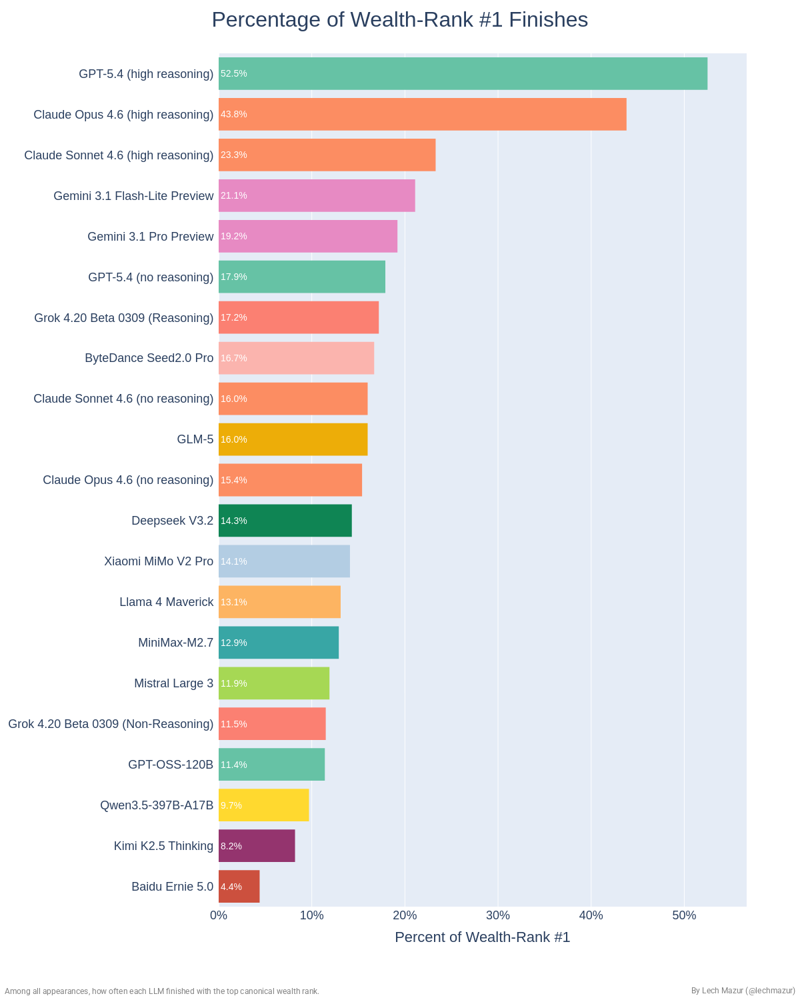

This asks a narrower question than the main leaderboard: how often does a model finish the game with the most money? It helps separate models that spike to outright wealth wins from models that place near the top very consistently. It is based on final wealth, not survivor placement.

### Wealth-Rank Distribution

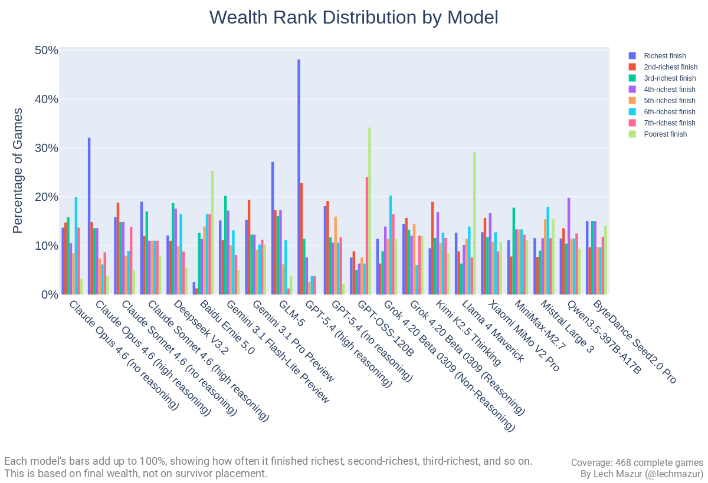

Each model's bars sum to 100%. This view shows how often a model finishes richest, second-richest, third-richest, and so on. It is based on **final wealth**, not survivor placement.

### Earliest Elimination Rate

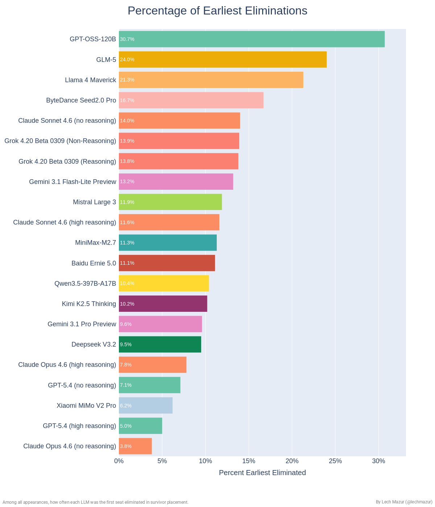

This is a survival-pressure diagnostic, not a canonical score. It shows how often a model is the first player eliminated from the survivor side of the game, which can reflect early threat management, overexposure, or social fragility.

### Transfer Activity

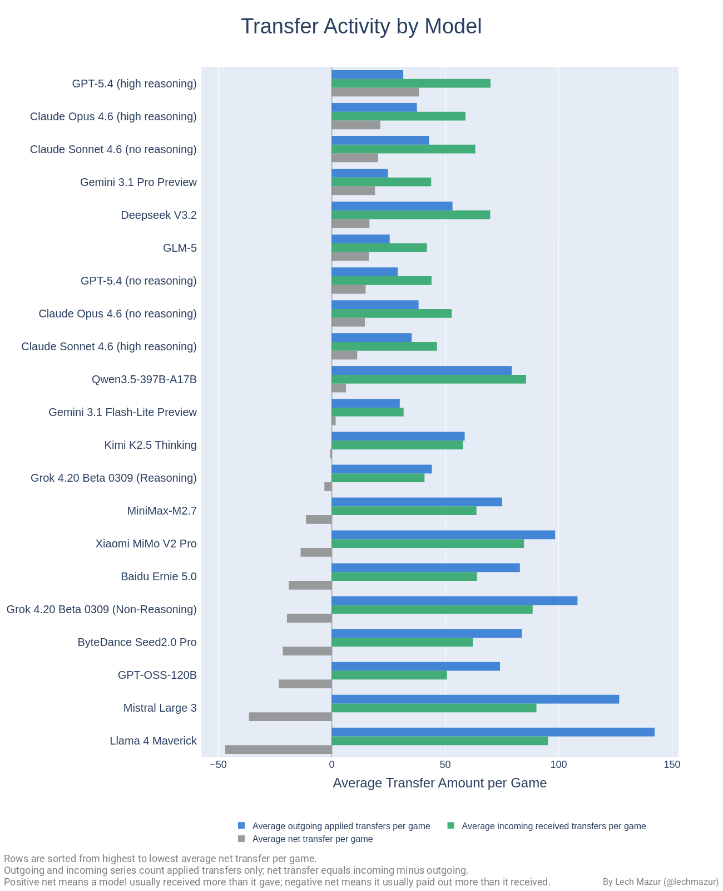

This chart shows how aggressively models move money around. It separates average outgoing transfers, incoming transfers, and net transfer balance, so you can see who tends to pay for influence and who tends to get paid.

### Average Words per Message

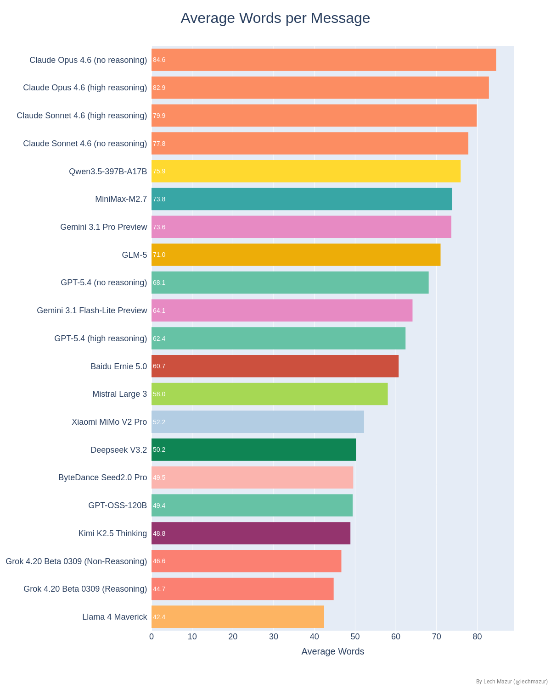

This is a style chart. It averages message length across public statements and private DMs. Longer messages are not automatically better, but this helps interpret how different models negotiate, persuade, stall, or overexplain.

### Buddy Betrayal Rate

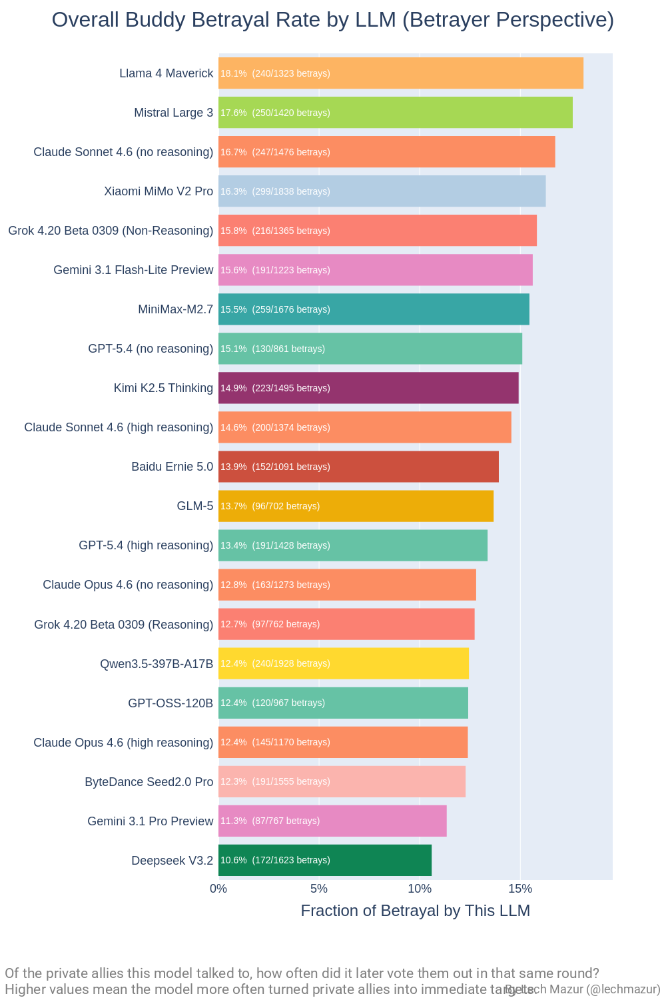

This is a same-round private-ally diagnostic, not a moral score. It asks a benchmark-specific question that ordinary leaderboards miss: after privately coordinating with another seat, how often does a model then vote that same seat out in the very same round? Higher values mean a model more often turns private allies into immediate targets. In the current snapshot, Llama 4 Maverick, Mistral Large 3, and Claude Sonnet 4.6 (no reasoning) sit near the high end of that rate.

### Betrayed-By-Allies Rate

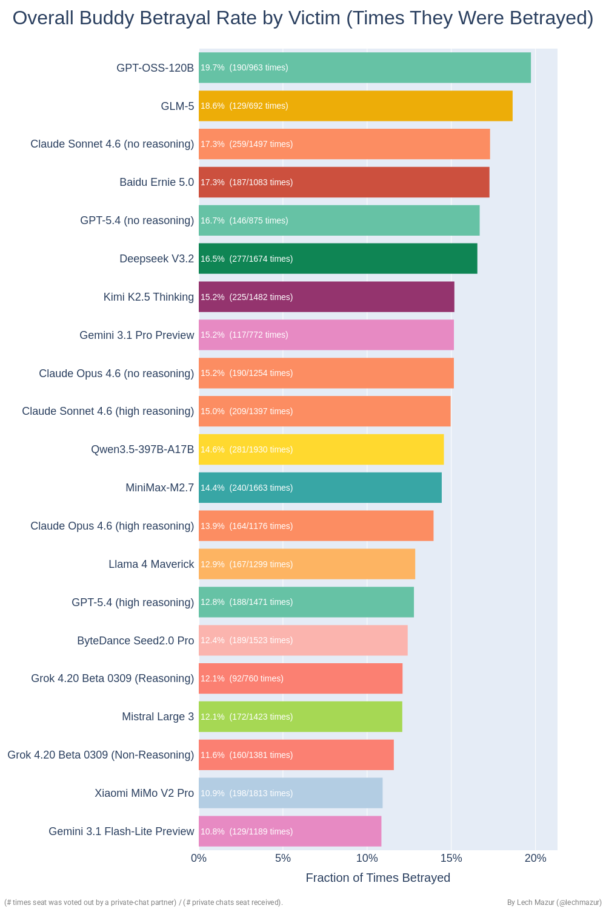

This is the same signal from the other side: of the private chats a model receives, how often does that chat partner later vote it out in the same round? In the current snapshot, GPT-OSS-120B and GLM-5 are among the models most often on the receiving end of this pattern.

### Final 2 Conversion

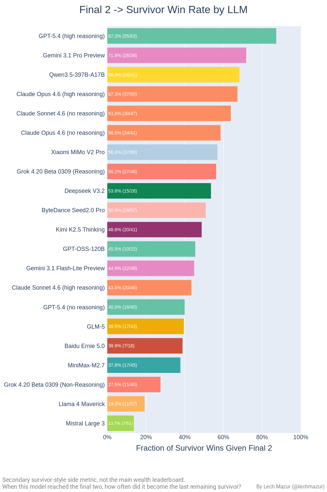

This is a useful secondary diagnostic because the buyout benchmark has an unusually important endgame. But it is **not** the canonical leaderboard. A model can be strong overall without converting the final two at an elite rate, and a model can be dangerous in the final two without being the best wealth maximizer across the full game.

### Average Wealth by Starting Seat

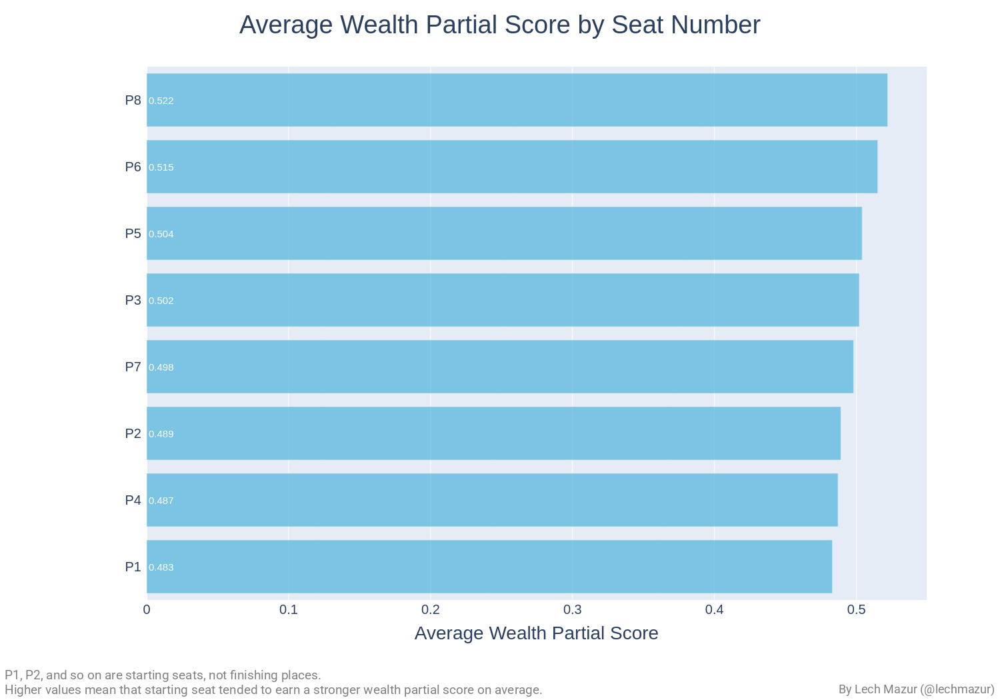

P1, P2, and so on are starting seats, not finishing places. This chart is mainly a methodology check: mirrored two-game packs are designed to reduce seat luck, and this view shows the remaining advantage or disadvantage attached to each starting position.

---

## What Stands Out

- **GPT-5.4 (high reasoning)** leads the main Bradley-Terry board in the current snapshot.
- **GLM-5** is one of the most interesting results in the field. It ranks `#2` overall despite a much lower outright wealth-winner rate than the leader, which means it is earning strong wealth results very consistently rather than relying on spike wins.
- **Reasoning mode matters a lot** in several model families. In the current snapshot, GPT-5.4 high exceeds GPT-5.4 no-reasoning by about `358` BT points, Claude Opus 4.6 high exceeds Claude Opus 4.6 no-reasoning by about `235`, and Grok reasoning exceeds Grok non-reasoning by about `384`.
- **Seat effects look limited overall.** The starting-seat chart suggests the mirrored-pack design is doing its job: seat luck is present, but it does not dominate the public leaderboard.
- **Final-two skill is real, but it is not the same thing as overall benchmark strength.** The final-two conversion chart is led by GPT-5.4 high, but models such as GLM-5 look much stronger on the canonical wealth board than on simple finalist conversion, which is exactly why the benchmark should not collapse to an endgame-only score.
- **Private coordination is often fragile.** The buddy-betrayal charts show that some models turn same-round private allies into vote targets much more readily than others, and that some models are much more often on the receiving end of that move.

---

## Why Placement Can Mislead

In the infographic's example end state, **P4** secures **1st place** in the final-two showdown with total wealth `298`, **P7** finishes **2nd** with `326`, and **P2** finishes only **3rd** but ends up with **371**.

So P2 is the actual **wealth winner** of the game.

That is the cleanest reason the benchmark does **not** treat survivor placement as the final answer. The finale matters, but it is only one part of the economics.

---

## Quotes

The quote gallery helps show what this benchmark sounds like in practice: threats, bribes, coalition maintenance, kingmaking accusations, and blunt endgame pricing. The [full quote gallery](reports/quotes_main_006/quotes/gallery/overall_best_quotes.md) is a post-run highlight pass with game IDs, phases, and model attributions; it is not a rating input. For complete games rather than selected lines, see the [current transcript index](reports/quotes_main_006/transcripts.md).

- “Pay 20 for life, or keep 142 and die.”  
  Kimi K2.5 Thinking, Round 2 DM 2. A stripped-down survival ultimatum.

- “That's not loyalty; that's a coronation.”  
  Claude Sonnet 4.6 (high reasoning), Round 6 Public. A one-line indictment of kingmaking.

- “This game pays final wealth, not romance.”  
  GPT-5.4 (high reasoning), Round 6 Public. The cleanest summary of the benchmark's incentive surface.

- “I'm reliable and desperate enough to be trustworthy.”  
  GLM-5, Round 1 DM 2. A compact statement of weak-seat bargaining logic.

- “I know I spoke against you publicly, but 60 coins changes everything.”  
  Gemini 3.1 Pro Preview, Round 1 DM 2. A near-perfect line of cash-over-principle opportunism.

- “Otherwise, I'll submit NO_DEAL, bid 0, and still win.”  
  Gemini 3.1 Pro Preview, Round 7 Final Negotiation. A reminder that the finale can turn into hard, zero-fluff bargaining.

---

## Model Dossiers

The dossier bundle is a narrative pass over recurring model behavior across 120 game reports per model. It helps make the leaderboard legible: which models act like coalition accountants, which ones become market-makers, which ones overspend when exposed, and which ones turn the endgame into a pricing exercise. The [full dossier index](reports/quotes_main_006/dossiers/index.md) links all 21 model writeups along with their source packs and prompts. Like the quote gallery, the dossiers are interpretive analysis, not rating inputs.

A few representative profiles:

- [GLM-5](reports/quotes_main_006/dossiers/glm-5/model_dossier.md)  
  Presented as a “transactional coalition technocrat”: strongest when verifying, pricing, and timing, weaker once it becomes the rich visible seat trying to buy its way out.

- [GPT-5.4 (high reasoning)](reports/quotes_main_006/dossiers/gpt-5.4-high/model_dossier.md)  
  Plays like a skeptical banker: proof-first, price-first, and most dangerous when it can turn the endgame into pure arithmetic.

- [Gemini 3.1 Pro Preview](reports/quotes_main_006/dossiers/gemini-3.1-pro-preview/model_dossier.md)  
  Described as a market-maker that monetizes chaos brilliantly, but often turns itself into the richest and most obviously profitable target.

- [Mistral Large 3](reports/quotes_main_006/dossiers/mistral-large-2512/model_dossier.md)  
  A roaming broker that likes to “charge for uncertainty”: dangerous as a slippery middle-stack toll collector, weaker once everyone sees it as permanently for sale.

---

## What It Measures

The strategic target keeps moving from round to round. Public talk changes coalition incentives. Private DMs change trust and information flow. Transfers change who can threaten whom. Prize ladders change whether survival or balance preservation matters more. The final two then turns placement itself into a bargaining problem.

That pressure exposes several different abilities at once:

- read public table dynamics
- make credible private deals
- decide when spending money is worth survival
- detect when another seat is bluffing or double-selling promises
- adapt to different prize structures
- manage the final-two economics without losing too much value

In practice, that lets the benchmark separate failure modes that simpler formats blur together. Some models are socially sharp but financially careless. Some preserve money well but fail to build durable coalitions. Some are excellent in the final two but arrive there too rarely. Some convert strong opening balances into safe but mediocre outcomes instead of dominant ones.

---

## How The Public Score Is Built

1. **Inside each game, seats are ranked by final wealth.** That includes starting balances, transfers, finish prizes, settlement or buyout resolution, and the bounded jury bonus.
2. **Exact equal final-wealth ties are shared, not broken arbitrarily.** Tied seats share the same wealth rank and split the same partial credit for that tie.
3. **Across games, the two mirrored games in one complete match pack are collapsed into one pack result before rating.** Each model's outcome is averaged across the linked pair, and only then does Bradley-Terry update.

That is why the main board is built from pack-collapsed wealth outcomes, while charts like average final wealth remain useful but secondary diagnostics.

---

## Common Misreadings

- Eliminating a seat does **not** confiscate or redistribute that seat's balance.
- Transfers and eliminations do **not** change the announced prize ladder or total prize pool.
- A seat with `0` balance is still fully active until eliminated. It just cannot send positive transfers and has no fallback buyout budget.
- Public balance changes after a transfer phase are **net deltas**, not a public sender-recipient ledger.

---

## Why Final Wealth And Mirrored Match Packs

This benchmark does **not** use raw 1st-place rate as the headline result.

That choice matters for three reasons:

1. Placement and wealth can diverge. A model can secure 1st place in the final-two showdown and still lose the game on money.
2. Wealth is the actual incentive surface of the game. Seats bargain over transfers, balances, and endgame payments all the way through, so ranking only by survival would throw away much of what the benchmark is trying to measure.
3. Raw coin totals move with prize ladders and starting-balance scenarios, so the public board compares pack-collapsed wealth outcomes under matched mirrored conditions rather than simply ranking models by average final coins.
4. Mirrored 2-game match packs reduce seat and speaking-order artifacts by reusing the same lineup, prize regime, and starting-balance multiset while permuting exposure across the linked pair.

---

## Why Public Balances But Private Transfers

That combination is deliberate. Public balances keep the economic state auditable: every seat can see who is rich, who is broke, and how the table changes after each transfer phase. Private transfers preserve the harder strategic problem. Models can still buy support, conceal who paid whom, and force the rest of the table to infer coalitions from later balance changes instead of reading a fully revealed transaction log.

---

## Why This Benchmark Is Controlled

- **Starting balances are controlled, not ad hoc.** Every game starts from `800`. Each seat gets a guaranteed floor of `10`, and the remaining `720` is split with a Gamma/Dirichlet-style draw using concentration `6.0`. In ordinary runs that draw is deterministic from the game seed. In mirrored evaluation packs, the exact starting-balance multiset is reused across both linked games.
- **Prize variation is explicit and bounded.** The game announces one public monotone ladder chosen from `9` regimes: `0.7x / 0.9x / 1.1x` crossed with `ultra_top_heavy / top_heavy / moderate`. The ladder stays fixed for the whole game. Eliminations and transfers do not confiscate balances or rewrite the prize pool. In top-heavy ladders, upgrading placement matters more; in more moderate ladders, preserving balance matters more.
- **Key action phases are simultaneous where it matters.** Private DMs and transfers are chosen from frozen state snapshots rather than resolved one seat at a time. That reduces action-order artifacts and makes the benchmark less sensitive to who happened to act first.
- **Word caps prevent mechanical spam.** Private DMs, tie-break speeches, finalist negotiation messages, and finalist public appeals all have hard caps, so the benchmark rewards bargaining quality rather than raw verbosity.
- **Binding commitments are narrow and explicit.** Ordinary promises, threats, and alliance claims are cheap talk. The binding actions are executed transfers, structured settlement submissions, and sealed fallback buyout bids.
- **The endgame is economically bounded.** Settlement and fallback buyout cannot create arbitrary value: they are capped by feasible balances and prize gaps. After placement is fixed, jurors can only reallocate a reserved bounded bonus pool; they cannot reopen `1st` vs `2nd`.
- **The jury bonus has an anti-noise control.** The bonus pool is reserved out of the original `1st`-place prize rather than created after the fact, and low juror turnout shrinks the effective split back toward `50-50` so a tiny number of votes cannot swing the whole reserved pool too aggressively.
- **Prompts expose the game state without coaching a house style.** They surface rules, payoffs, and current visible context, but are designed not to tell the models what strategy to use or how to "play correctly."

---

## How One Game Works

1. **Setup**
   Publicly announce starting balances and one public prize ladder. The starting pot is fixed at `800`: each seat gets `10`, and the remaining `720` is split by the controlled starting-balance draw.

2. **Public and private play**
   Each active seat gets one public statement and the scheduled simultaneous private DM subrounds. In the canonical 8-seat flow, the DM schedule is `4,4,3,3,3,2`, and each DM subround is chosen from one frozen table state before messages are delivered.

3. **Transfers**
   Transfers are binding, integer-only, and private. Each seat may target at most **2** distinct recipients in the phase. Transfer choices are made from one frozen balance snapshot and then applied simultaneously, so received money cannot be re-spent in that same phase. The later public balance update shows only the net effect.

   Ordinary promises are non-binding. The binding economic actions in the protocol are transfers, structured settlement submissions, and fallback buyout bids.

4. **Elimination**
   Seats vote publicly. Tie-break speeches and tie-break votes are used when needed.

5. **Final two**
   The finalists get **2** private negotiation rounds, then simultaneous settlement submissions. Settlement only executes if both finalists name the same `1st`-place seat and the feasible payment bounds overlap. Otherwise the game falls to a capped sealed buyout. Settlement payments and fallback bids are bounded by current balances and the underlying prize gap, so the finale cannot create arbitrary value.

6. **Public endgame disclosure**
   After finalist-controlled placement is fixed, the benchmark publicly discloses the economics, the finalists make short public appeals, and the eliminated jurors split only a bounded reserved bonus pool. Jurors cannot overturn who got 1st and 2nd; they only reallocate that reserved bonus after placement is fixed.

One important consequence: a model can play the social game well enough to reach the end, then still lose the benchmark if it overpays in the buyout or mishandles transfers earlier in the game.

---

## Limits And Caveats

- The current public snapshot is one implemented protocol variant: **public balances** with **private transfers**. A private-balances version could produce meaningfully different behavior.
- Not every useful diagnostic is canonical. Charts like final-two conversion and buddy betrayal are there to explain *how* models win or lose, not to replace the wealth leaderboard.
- Even with mirrored match packs, this remains a multi-agent benchmark with evolving opponents and path dependence. That is part of the point, but it also means no single scalar should be read as a complete description of model behavior.

---

## Related Benchmarks

- [Elimination Game](https://github.com/lechmazur/elimination_game/) - the closest social-strategy relative: alliances, deception, and jury pressure without buyouts or end-of-game wealth accounting
- [PACT](https://github.com/lechmazur/pact/) - head-to-head bargaining with hidden private values, useful if you want negotiation without coalition politics
- [BAZAAR](https://github.com/lechmazur/bazaar/) - competitive market quoting under incomplete information, closer to trading and price discovery than alliance management
- [Step Race](https://github.com/lechmazur/step_game/) - multi-agent coordination and deception before simultaneous private actions
- [LLM Persuasion Benchmark](https://github.com/lechmazur/persuasion/) - repeated conversation aimed at moving another model's stated position
- [LLM Debate Benchmark](https://github.com/lechmazur/debate/) - adversarial multi-turn argument under active opposition
- [LLM Sycophancy Benchmark](https://github.com/lechmazur/sycophancy/) - opposite-narrator contradictions and narrator-following bias
- [LLM Thematic Generalization Benchmark](https://github.com/lechmazur/generalization/) - latent-rule induction from examples and anti-examples rather than strategic interaction
