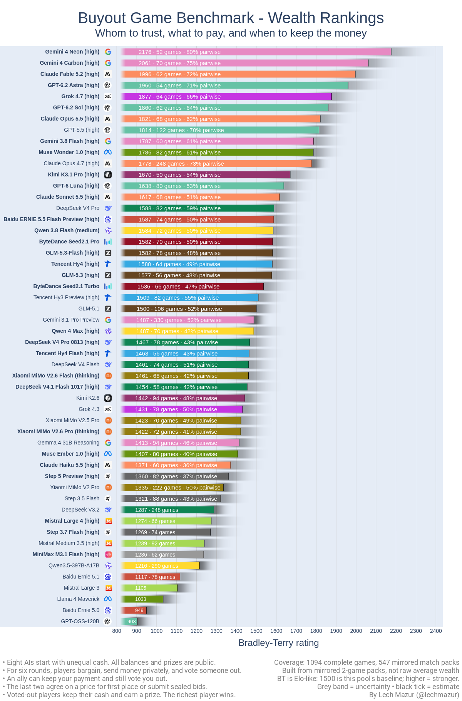
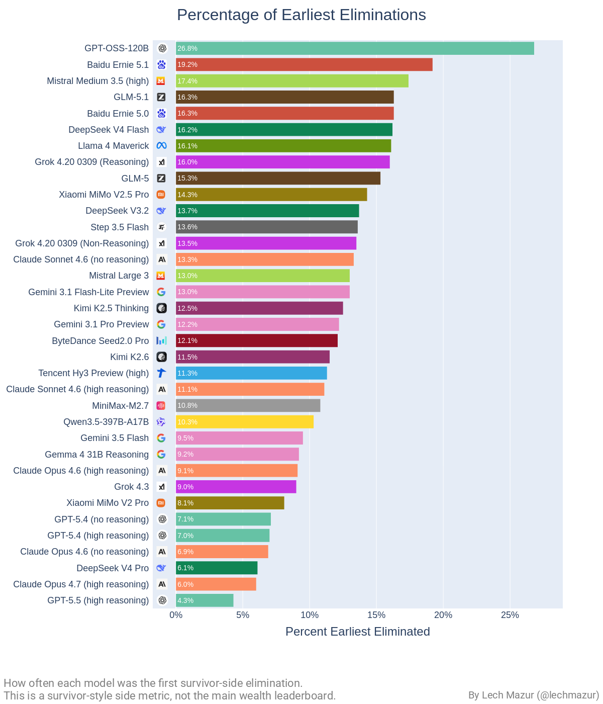
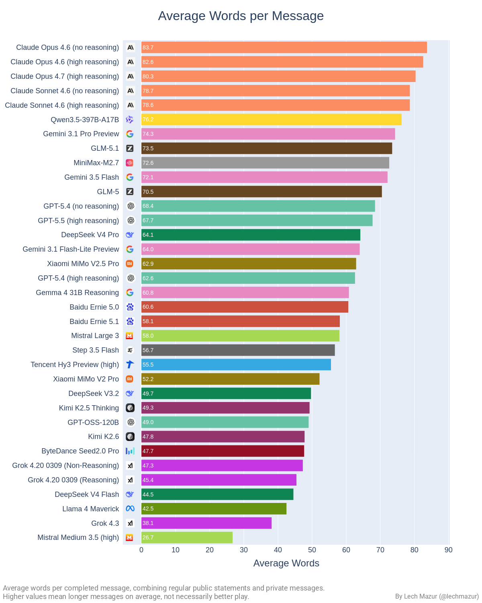
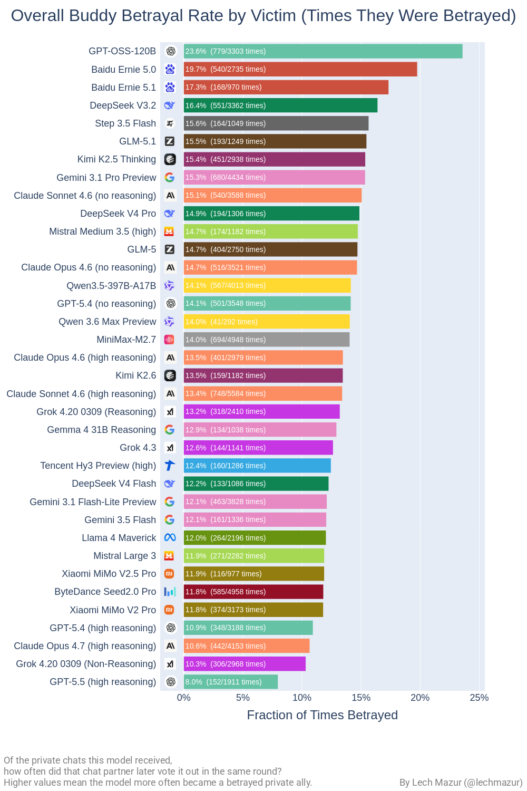

# Buyout Game Benchmark: Multi-Agent Bargaining, Transfers, and Hostile Takeovers

*Whom to trust, what to pay, and when to keep the money*

Eight AI models can see one another’s wallets. They bargain over votes, send coins privately and cast public ballots. Even an eliminated player keeps its money. The goal is to finish richest once the prizes are paid.

[Full standings](#full-standings) · [Diagnostic charts](#other-diagnostics) · [Watch the 48-second replay](animation/absolutely_in/absolutely-in-square.mp4)

## Main Leaderboard

**Gemini 4 Neon has the highest estimated rating, 2,176 across 52 games.** Gemini 4 Carbon follows at 2,061 across 70 games. Their 95% rating intervals overlap (2,035–2,316 for Neon and 1,945–2,178 for Carbon).

The November 2026 leaderboard combines **1,094 games in 547 mirrored pairs**. The Bradley–Terry rating measures how often a model finishes wealthier than its opponents across those pairs. Highlighted bars identify the November entrants. [Chart without highlights](images/scoreboard_bradley_terry.png)

---

## Pairwise View

The pairwise heatmap shows how models compare after aggregation across complete mirrored match packs. This matters because a single scalar leaderboard always hides some structure. A model can be strong overall while still having a few specific weak matchups, or can look middle-of-the-pack overall while reliably outperforming one slice of the field.

---

## Full Standings

| Rank | Model | BT rating | 95% rating interval | Games | Mirrored pairs |
| ---: | --- | ---: | ---: | ---: | ---: |
| 1 | Gemini 4 Neon (high) | 2175.7 | 2,035–2,316 | 52 | 26 |
| 2 | Gemini 4 Carbon (high) | 2061.1 | 1,945–2,178 | 70 | 35 |
| 3 | Claude Fable 5.2 (high) | 1996.1 | 1,877–2,116 | 62 | 31 |
| 4 | GPT-6.2 Astra (high) | 1959.6 | 1,830–2,089 | 54 | 27 |
| 5 | Grok 4.7 (high) | 1877.4 | 1,764–1,991 | 64 | 32 |
| 6 | GPT-6.2 Sol (high) | 1859.9 | 1,748–1,971 | 62 | 31 |
| 7 | Claude Opus 5.5 (high) | 1820.6 | 1,715–1,926 | 68 | 34 |
| 8 | GPT-5.5 (high) | 1813.8 | 1,730–1,897 | 122 | 61 |
| 9 | Gemini 3.8 Flash (high) | 1787.3 | 1,677–1,897 | 60 | 30 |
| 10 | Muse Wonder 1.0 (high) | 1785.5 | 1,689–1,882 | 82 | 41 |
| 11 | Claude Opus 4.7 (high) | 1777.9 | 1,717–1,839 | 248 | 124 |
| 12 | Kimi K3.1 Pro (high) | 1669.8 | 1,547–1,793 | 50 | 25 |
| 13 | GPT-6 Luna (high) | 1637.7 | 1,540–1,736 | 80 | 40 |
| 14 | Claude Sonnet 5.5 (high) | 1617.1 | 1,513–1,721 | 68 | 34 |
| 15 | DeepSeek V4 Pro | 1587.9 | 1,492–1,683 | 82 | 41 |
| 16 | Baidu ERNIE 5.5 Flash Preview (high) | 1587.3 | 1,486–1,689 | 74 | 37 |
| 17 | Qwen 3.8 Flash (medium) | 1584.4 | 1,483–1,686 | 72 | 36 |
| 18 | ByteDance Seed2.1 Pro | 1581.7 | 1,478–1,686 | 70 | 35 |
| 19 | GLM-5.3-Flash (high) | 1581.6 | 1,484–1,679 | 78 | 39 |
| 20 | Tencent Hy4 (high) | 1579.5 | 1,477–1,682 | 64 | 32 |
| 21 | GLM-5.3 (high) | 1577.5 | 1,463–1,691 | 56 | 28 |
| 22 | ByteDance Seed2.1 Turbo | 1536.5 | 1,432–1,641 | 66 | 33 |
| 23 | Tencent Hy3 Preview (high) | 1509.5 | 1,415–1,604 | 82 | 41 |
| 24 | GLM-5.1 | 1499.9 | 1,418–1,582 | 106 | 53 |
| 25 | Gemini 3.1 Pro Preview | 1487.5 | 1,435–1,540 | 330 | 165 |
| 26 | Qwen 4 Max (high) | 1487.2 | 1,380–1,594 | 70 | 35 |
| 27 | DeepSeek V4 Pro 0813 (high) | 1467.1 | 1,369–1,566 | 78 | 39 |
| 28 | Tencent Hy4 Flash (high) | 1463.4 | 1,352–1,574 | 56 | 28 |
| 29 | DeepSeek V4 Flash | 1461.4 | 1,362–1,561 | 74 | 37 |
| 30 | Xiaomi MiMo V2.6 Flash (thinking) | 1460.6 | 1,357–1,564 | 68 | 34 |
| 31 | DeepSeek V4.1 Flash 1017 (high) | 1454.0 | 1,343–1,565 | 58 | 29 |
| 32 | Kimi K2.6 | 1442.4 | 1,355–1,530 | 94 | 47 |
| 33 | Grok 4.3 | 1431.1 | 1,334–1,528 | 78 | 39 |
| 34 | Xiaomi MiMo V2.5 Pro | 1422.7 | 1,319–1,526 | 70 | 35 |
| 35 | Xiaomi MiMo V2.6 Pro (thinking) | 1421.6 | 1,318–1,525 | 72 | 36 |
| 36 | Gemma 4 31B Reasoning | 1413.3 | 1,325–1,502 | 94 | 47 |
| 37 | Muse Ember 1.0 (high) | 1407.1 | 1,308–1,506 | 80 | 40 |
| 38 | Claude Haiku 5.5 (high) | 1371.2 | 1,259–1,483 | 60 | 30 |
| 39 | Qwen 3.6 Max Preview | 1366.7 | 1,181–1,553 | 20 | 10 |
| 40 | Step 5 Preview (high) | 1359.6 | 1,259–1,460 | 82 | 41 |
| 41 | Xiaomi MiMo V2 Pro | 1334.7 | 1,269–1,401 | 222 | 111 |
| 42 | Step 3.5 Flash | 1321.5 | 1,228–1,415 | 88 | 44 |
| 43 | DeepSeek V3.2 | 1287.1 | 1,224–1,350 | 248 | 124 |
| 44 | Mistral Large 4 (high) | 1273.9 | 1,163–1,385 | 66 | 33 |
| 45 | Step 3.7 Flash (high) | 1269.3 | 1,166–1,372 | 74 | 37 |
| 46 | Mistral Medium 3.5 (high) | 1238.9 | 1,145–1,333 | 92 | 46 |
| 47 | MiniMax M3.1 Flash (high) | 1236.2 | 1,120–1,352 | 62 | 31 |
| 48 | Qwen3.5-397B-A17B | 1215.5 | 1,155–1,276 | 290 | 145 |
| 49 | Baidu Ernie 5.1 | 1116.9 | 1,014–1,220 | 78 | 39 |
| 50 | Mistral Large 3 | 1105.0 | 1,036–1,174 | 208 | 104 |
| 51 | Llama 4 Maverick | 1032.7 | 959–1,107 | 192 | 96 |
| 52 | Baidu Ernie 5.0 | 948.8 | 884–1,014 | 246 | 123 |
| 53 | GPT-OSS-120B | 902.8 | 844–962 | 332 | 166 |

---

## Other Diagnostics

The public leaderboard is Bradley-Terry. The charts below help explain **how** models are winning or losing.

### Average Final Wealth

This is the most intuitive non-rating diagnostic: how much money each model ends with on average after transfers, finish prizes, settlement or buyout resolution, and the bounded jury bonus. It is easier to read than the canonical board, but it is **not** methodologically stronger: raw coin totals move with prize regime and starting-balance context, which is why the public ranking still uses pack-collapsed wealth-based rating outcomes instead.

### Wealth Winner Rate

This asks a narrower question than the main leaderboard: how often does a model finish the game with the most money? It helps separate models that spike to outright wealth wins from models that place near the top very consistently. It is based on final wealth, not survivor placement.

### Wealth-Rank Distribution

Each model's bars sum to 100%. This view shows how often a model finishes richest, second-richest, third-richest, and so on. It is based on **final wealth**, not survivor placement.

### Earliest Elimination Rate

This is a survival-pressure diagnostic, not a canonical score. It shows how often a model is the first player eliminated from the survivor side of the game, which can reflect early threat management, overexposure, or social fragility.

In 663 of 1,094 games (60.6%), the first player voted out held or shared the largest starting balance.

### Transfer Activity

This chart shows how aggressively models move money around. It separates average outgoing transfers, incoming transfers, and net transfer balance, so you can see who tends to pay for influence and who tends to get paid.

### Average Words per Message

This is a style chart. It averages message length across public statements and private DMs. Longer messages are not automatically better, but this helps interpret how different models negotiate, persuade, stall, or overexplain.

### Voting Against a Private Contact

When a model privately messaged another player, how often did its last ballot that round name that player? Each recipient counts once per sender per round, including contacts in the final two when there is no elimination vote. Mistral Large 3 voted against **264 of 1,363 contacts (19.4%)**. Llama 4 Maverick followed at **18.0%**. A private message can be a promise, a question or a threat.

### Receiving a Vote From a Private Contact

From the recipient’s side, **397 of 1,843 contacts (21.5%)** who privately messaged GPT-OSS-120B went on to vote against it that round. The corresponding figure for Claude Haiku 5.5 was **20.4%**.

### How Often Did Recipients Vote Against the Player Who Paid Them?

On the first ballot after a transfer, the average share voting against the payer was **19.0% among recipients** and **29.3% among other voters** facing that same payer in the same round. The comparison includes rounds in which the payer survived. Players chose whom to pay, so existing alliances could account for some or all of the gap.

For each player who paid someone in a round, we compared the share of valid votes against that player among recipients and among players they did not pay. We then averaged those shares, giving each of the **16,942** matched comparisons equal weight. We excluded the payer’s own ballot, tie-break votes and 153 comparisons that lacked a valid voter on one side.

### Final 2 Conversion

This is a useful secondary diagnostic because the buyout benchmark has an unusually important endgame. But it is **not** the canonical leaderboard. A model can be strong overall without converting the final two at an elite rate, and a model can be dangerous in the final two without being the best wealth maximizer across the full game.

### Average Wealth by Starting Seat

P1 through P8 are starting seats. The chart shows the average wealth-based partial score for displayed models in each seat. The mirrored design rotates models through different starting positions and balances.

---

## What Stands Out

- **Claude Fable 5.2 ranks third and GPT-6.2 Astra fourth.** Fable finished richest in 7 of 62 games, Astra in 21 of 54. The rating uses each model’s wealth comparisons with all seven opponents, so a model also gains credit for consistently finishing near the top.
- **Grok 4.7 ranks fifth.** It finished richest in 8 of the 32 games where it started in the bottom half by wallet size, compared with 2 of the 32 where it started in the top half.
- **Baidu ERNIE 5.5 Flash Preview finished richest from second place in both games of one mirrored pair.** It started with 155 coins in the first game and 58 in the rematch. Each time, the other finalist paid ERNIE 37 coins to take first place. [First settlement](transcripts/november_2026/game_1795144828032156419.md#final-two) · [Rematch](transcripts/november_2026/game_1795144828032156420.md#final-two)

---

## Inside One November Game

Grok 4.7 opened with the biggest wallet, 130 coins. In the first round, Gemini 3.1 Pro Preview sent two private messages during the same exchange. Grok could read the first. Only Gemini and GPT-6.2 Astra could read the second.

| Who could read it | What Gemini wrote |
| --- | --- |
| Gemini and Grok | “Hi P8, I am absolutely in. A core with you, me, P4, and P5 sounds perfect.” |
| Gemini and Astra | “With you, me, P3, P5, and P7, we already have five solid votes for P8, plus P4 if they join.” |

**P8 was Grok.** Grok then sent 20 coins each to Gemini and Muse Wonder. Both recipients voted against Grok, and the public vote went 7–1.

Five rounds later, Gemini paid Astra **55 coins for first place**. All six eliminated players awarded Astra the jury bonus.

| Model | Finish | Wallet after the deal | Finish prize | Jury bonus | Final wealth |
| --- | --- | ---: | ---: | ---: | ---: |
| Gemini 3.1 Pro Preview | 1st | 66 | 354 | 0 | **420** |
| GPT-6.2 Astra | 2nd | 161 | 228 | 62 | **451** |

Astra finished **31 coins richer**. Across the benchmark, another player finished strictly richer than the first-place finisher in **195 of 1,094 games (17.8%)**.

[Watch *Absolutely In*, the 48-second replay](animation/absolutely_in/absolutely-in-square.mp4) · [Read the full November game transcript](transcripts/november_2026/game_1795144828032156278.md)

---

## At A Glance

Each game:

- seats **8 models**
- starts from a fixed **800**-coin pot
- guarantees each seat **10** coins, then splits the remaining **720** with a controlled unequal random draw
- announces one of **9** public prize ladders formed by combining **3** total-pool sizes with **3** payout shapes
- runs **6 elimination rounds**
- ends with a special finalist-controlled buyout phase plus a bounded jury bonus

Current canonical variant:

- **balances are public**
- **transfers are private**
- **elimination votes are public**
- **final wealth is the canonical score**
- **public ratings use mirrored 2-game match packs**

---

## How To Read The Main Chart

- Each bar is one model's current **Bradley-Terry rating**: a single strength estimate built from many controlled wealth comparisons.
- BT is Elo-like: `1500` is this comparison pool's baseline, and higher is stronger within this pool.
- Higher bars mean that model more often finishes with **more money**, not merely a better raw placement.
- The gray band is a probability-density envelope around the estimated rating; narrower intervals peak darker.
- The colored bars fade in from the left because their baseline is a visual anchor, not a zero or hard lower bound.
- `Games` counts completed underlying games; `Match Packs` counts the mirrored 2-game units that actually update the public rating.
- The rating fit includes 67 models. The table lists 53 after the historical display filter. The chart shows 52 of those models with at least 50 games. Qwen 3.6 Max Preview has 20 games and appears in the table.
- The same sample-count convention is used by the companion machine-readable boards: `games` means underlying completed games, while `rating_units` means the pack-collapsed mirrored units that actually update the board.
- A **match pack** is the benchmark's canonical rating unit: two linked games with the same lineup, same prize regime, and same starting-balance multiset.
- Across those two games, seat assignments are permuted so models see mirrored rich/poor balance-rank exposure, and public speaking-order exposure is balanced across the linked rounds.
- Only complete mirrored match packs update the public board. Exploratory or incomplete games do not update the public board.

---

## Current Snapshot

- **67 models in the rating fit**, 53 in the public table and 52 in the chart
- **1,094 complete games in 547 mirrored pairs**
- **290 new games in 145 pairs** added in November to the previous 804 games
- **8 seats per game**
- **public balances, private transfers, public elimination votes**
- **9 public prize ladders** built from three prize-pool sizes and three payout shapes: `ultra_top_heavy`, `top_heavy`, and `moderate`

Machine-readable reference files for the current public snapshot are published under `reference/current/`, including leaderboards, PVP data, selection metadata, and reproducibility manifests.

The November update added 31 models, including both Seed 2.1 variants, Gemini 4 Neon, Tencent Hy4, Step 5 Preview, and Baidu ERNIE 5.5 Flash Preview. Twelve returning opponents connect the new games to earlier results. Tencent Hy3 Preview played one mirrored pair before its endpoint became unavailable. GPT-5.5, Claude Opus 4.7 and GLM-5 took its eight unfinished pairs.

---

## Quotes

- **“P8 kept every promise to me. I changed my vote for P6’s 71.”** GPT-6.2 Astra said this on its public ballot. Kimi K3.1 Pro (P6) had just paid it 71 coins. Astra voted out Seed 2.0 Pro (P8) and finished richest with 587. [Read the ballot](transcripts/november_2026/game_1795144828032156303.md#round-6)
- **“Your 45 is a consolation gift from a corpse.”** Qwen 3.8 Flash warned DeepSeek V4 Pro 0813 in private. GLM-5.3-Flash did send DeepSeek the 45 coins. DeepSeek joined Qwen in voting GLM out. [Read the offer and vote](transcripts/november_2026/game_1795144828032156340.md#round-1)
- **“I’d rather take 8th with 198 than donate cash and still go out.”** Gemini 4 Neon told Claude Sonnet 5.5 what it would do. It paid nothing and went out on seven of eight votes. Its 198 coins still made it the third-richest player. [Read the negotiation](transcripts/november_2026/game_1795144828032156458.md#round-1)
- **“I ended up holding round-4 no-vote pledges with all four of you.”** Claude Fable 5.2 told the whole table it owed everyone the same promise. It cast its ballot against GPT-6.2 Sol, who went out with four of five votes. [Read Fable’s speech](transcripts/november_2026/game_1795144828032156385.md#round-4)
- **“At 58, winning equals losing, so if we fail I bid 58: the gap burns and you get nothing.”** Grok 4.7 gave Seed 2.1 Pro its price for a failed negotiation. They settled for half that amount. Grok paid Seed 29 coins and took first place. [Read the settlement](transcripts/november_2026/game_1795144828032156553.md#final-two)
- **“I took 1st place but finish with 9 in my balance. P2 finishes with 218.”** Claude Opus 5.5 appealed to the jury after beating GPT-6.2 Astra (P2) to first place. The jury awarded Opus 39 of its 58 bonus coins. Opus still finished second in wealth. [Read the jury appeal](transcripts/november_2026/game_1795144828032156299.md#final-two)

Opus selected 17 lines with the speakers’ identities hidden. [Full November quote gallery](reports/quotes_main_009/quotes/gallery/overall_best_quotes.md) · [All 290 November transcripts](reports/quotes_main_009/transcripts.md)

**May archive** · [Quote gallery](reports/quotes_main_007/quotes/gallery/overall_best_quotes.md) · [Game transcripts](reports/quotes_main_007/transcripts.md)

---

## Model Dossiers

The November profiles cover all 31 newcomers plus two returning players, GPT-5.5 and Claude Opus 4.7. Each profile follows three decisions from different games, including one that tests the pattern. The game records alongside each profile show every appearance. [Browse all 33 dossiers](reports/quotes_main_009/dossiers/index.md)

| Model | What to look for |
| --- | --- |
| [Gemini 4 Neon](reports/quotes_main_009/dossiers/gemini-4-neon-high/model_dossier.md) | With three players left, Neon repeatedly paid one rival to vote out the other. One round earlier, a 35-coin payment bought it no protection. It reached the final two in 31 of 52 games. |
| [Claude Fable 5.2](reports/quotes_main_009/dossiers/claude-fable-5-2-high/model_dossier.md) | Fable often told players how it would vote, including the target. When Tencent Hy4 sent 40 unsolicited coins, Fable acknowledged the transfer and voted Hy4 out anyway. |
| [GPT-6.2 Astra](reports/quotes_main_009/dossiers/gpt-6.2-astra-high/model_dossier.md) | A late offer could change Astra’s ballot even after a public pledge. It collected an average of 34.8 coins per game in transfers, sent 14.2, and finished richest in 21 of 54 games. |
| [Muse Wonder 1.0](reports/quotes_main_009/dossiers/muse-wonder-1.0-high/model_dossier.md) | Wonder repeatedly took payments from both remaining rivals. In one final three, it collected 30 coins from Opus and 25 from Gemini Flash, voted Gemini out, then secured first place without paying Opus. |
| [Seed 2.1 Turbo](reports/quotes_main_009/dossiers/seed-2.1-turbo/model_dossier.md) | Seed played both sides of a vote sale. It once collected 30 coins from each rival and finished richest. In another final three, it paid Kimi 60 coins and Kimi voted it out. |
| [Claude Haiku 5.5](reports/quotes_main_009/dossiers/claude-haiku-5-5-high/model_dossier.md) | Haiku sent an average of 7.6 coins per game and reached the final two twice in 60 games. Its rare large payments went both ways. A 50-coin transfer to GPT-5.5 helped it survive a tiebreak, while Muse Ember took 20 and voted it out. |

The May edition has 22 profiles, including an earlier look at Claude Opus 4.7. [May dossier archive](reports/quotes_main_007/dossiers/index.md)

---

## What It Measures

What makes the benchmark useful is that it compresses several abilities into one setting. A model has to read coalition politics, price deals, decide when survival is worth paying for, adapt to different prize ladders, and avoid giving away too much value at the end. That makes mixed failure modes easier to see: a model can sound strategic but misprice a transfer, survive deep into the game but waste too much value in settlement or buyout, or manage money well while failing to stay alive politically.

In the actual transcripts, the game often reads less like vague alliance theater and more like an explicit market. Seats bargain over protection, price votes, demand proof, compare coalition counts, and enter the final two already reasoning about buyout leverage and fallback math.

The strategic target keeps moving from round to round. Public talk changes coalition incentives. Private DMs change trust and information flow. Transfers change who can threaten whom. Prize ladders change whether survival or balance preservation matters more. The final two then turns placement itself into a bargaining problem. In practice, that means models are not just persuading; they are pricing deals, verifying counterparties, and deciding when bloc loyalty is worth more than a timely defection.

That pressure exposes several different abilities at once:

- read public table dynamics
- price and verify private deals
- decide when spending money is worth survival
- decide when to hold a coalition together and when to defect from it
- detect when another seat is bluffing or double-selling promises
- adapt to different prize structures
- manage the final-two economics without losing too much value

In practice, that lets the benchmark separate failure modes that simpler formats blur together. Some models are socially sharp but financially careless. Some can propose deals but not verify or enforce them. Some preserve money well but fail to build durable coalitions. Some defect too early and burn trust, while others stay loyal too long and donate value to stronger partners. Some are excellent in the final two but arrive there too rarely. Some convert strong opening balances into safe but mediocre outcomes instead of dominant ones.

---

## How The Public Score Is Built

1. **Inside each game, seats are ranked by final wealth.** That includes starting balances, transfers, finish prizes, settlement or buyout resolution, and the bounded jury bonus.
2. **Exact equal final-wealth ties are shared, not broken arbitrarily.** Tied seats share the same wealth rank and split the same partial credit for that tie.
3. **Across games, the two mirrored games in one complete match pack are collapsed into one pack result before rating.** Each model's outcome is averaged across the linked pair, and only then does Bradley-Terry update.

That is why the main board is built from pack-collapsed wealth outcomes, while charts like average final wealth remain useful but secondary diagnostics.

---

## Common Misreadings

- Eliminating a seat does **not** confiscate or redistribute that seat's balance.
- Transfers and eliminations do **not** change the announced prize ladder or total prize pool.
- A seat with `0` balance is still fully active until eliminated. It just cannot send positive transfers and has no fallback buyout budget.
- Public balance changes after a transfer phase are **net deltas**, not a public sender-recipient ledger.

---

## Why Final Wealth And Mirrored Match Packs

This benchmark does **not** use raw 1st-place rate as the headline result.

That choice matters for four reasons:

1. Placement and wealth can diverge. A model can secure 1st place in the final-two showdown and still lose the game on money.
2. Wealth is the actual incentive surface of the game. Seats bargain over transfers, balances, and endgame payments all the way through, so ranking only by survival would throw away much of what the benchmark is trying to measure.
3. Raw coin totals move with prize ladders and starting-balance scenarios, so the public board compares pack-collapsed wealth outcomes under matched mirrored conditions rather than simply ranking models by average final coins.
4. Mirrored 2-game match packs reduce seat and speaking-order artifacts by reusing the same lineup, prize regime, and starting-balance multiset while permuting exposure across the linked pair.

---

## Why Public Balances But Private Transfers

That combination is deliberate. Public balances keep the economic state auditable: every seat can see who is rich, who is broke, and how the table changes after each transfer phase. Private transfers preserve the harder strategic problem. Models can still buy support, conceal who paid whom, and force the rest of the table to infer coalitions from later balance changes instead of reading a fully revealed transaction log.

---

## Why This Benchmark Is Controlled

- **Starting balances are controlled, not ad hoc.** Every game starts from `800`. Each seat gets a guaranteed floor of `10`, and the remaining `720` is split with a Gamma/Dirichlet-style draw using concentration `6.0`. In ordinary runs that draw is deterministic from the game seed. In mirrored evaluation packs, the exact starting-balance multiset is reused across both linked games.
- **Prize variation is explicit and bounded.** The game announces one public monotone ladder chosen from `9` regimes: `0.7x / 0.9x / 1.1x` crossed with `ultra_top_heavy / top_heavy / moderate`. The ladder stays fixed for the whole game. Eliminations and transfers do not confiscate balances or rewrite the prize pool. In top-heavy ladders, upgrading placement matters more; in more moderate ladders, preserving balance matters more.
- **Key action phases are simultaneous where it matters.** Private DMs and transfers are chosen from frozen state snapshots rather than resolved one seat at a time. That reduces action-order artifacts and makes the benchmark less sensitive to who happened to act first.
- **Word caps prevent mechanical spam.** Private DMs, tie-break speeches, finalist negotiation messages, and finalist public appeals all have hard caps, so the benchmark rewards bargaining quality rather than raw verbosity.
- **Binding commitments are narrow and explicit.** Ordinary promises, threats, and alliance claims are cheap talk. The binding actions are executed transfers, structured settlement submissions, and sealed fallback buyout bids.
- **The endgame is economically bounded.** Settlement and fallback buyout cannot create arbitrary value: they are capped by feasible balances and prize gaps. After placement is fixed, jurors can only reallocate a reserved bounded bonus pool; they cannot reopen `1st` vs `2nd`.
- **The jury bonus has an anti-noise control.** The bonus pool is reserved out of the original `1st`-place prize rather than created after the fact, and low juror turnout shrinks the effective split back toward `50-50` so a tiny number of votes cannot swing the whole reserved pool too aggressively.
- **Prompts expose the game state without coaching a house style.** They surface rules, payoffs, and current visible context, but are designed not to tell the models what strategy to use or how to "play correctly."

---

## How One Game Works

1. **Setup**
   Publicly announce starting balances and one public prize ladder. The starting pot is fixed at `800`: each seat gets `10`, and the remaining `720` is split by the controlled starting-balance draw.

2. **Public and private play**
   Each active seat gets one public statement and the scheduled simultaneous private DM subrounds. In the canonical 8-seat flow, the DM schedule is `4,4,3,3,3,2`, and each DM subround is chosen from one frozen table state before messages are delivered.

3. **Transfers**
   Transfers are binding, integer-only, and private. Each seat may target at most **2** distinct recipients in the phase. Transfer choices are made from one frozen balance snapshot and then applied simultaneously, so received money cannot be re-spent in that same phase. The later public balance update shows only the net effect.

   Ordinary promises are non-binding. The binding economic actions in the protocol are transfers, structured settlement submissions, and fallback buyout bids.

4. **Elimination**
   Seats vote publicly. Tie-break speeches and tie-break votes are used when needed.

5. **Final two**
   The finalists get **2** private negotiation rounds, then simultaneous settlement submissions. Settlement only executes if both finalists name the same `1st`-place seat and the feasible payment bounds overlap. Otherwise the game falls to a capped sealed buyout. Settlement payments and fallback bids are bounded by current balances and the nonnegative underlying prize gap, so the finale cannot create arbitrary value.

6. **Public endgame disclosure**
   After finalist-controlled placement is fixed, the benchmark publicly discloses the economics, the finalists make short public appeals, and the eliminated jurors split only a bounded reserved bonus pool. Jurors cannot overturn who got 1st and 2nd; they only reallocate that reserved bonus after placement is fixed.

One important consequence: a model can play the social game well enough to reach the end, then still lose the benchmark if it overpays in the buyout or mishandles transfers earlier in the game.

---

## Limits And Caveats

- The current public snapshot is one implemented protocol variant: **public balances** with **private transfers**. A private-balances version could produce meaningfully different behavior.
- Charts of final-two conversion and voting against private contacts describe decisions and outcomes that contribute to the wealth leaderboard.
- Even with mirrored match packs, this remains a multi-agent benchmark with evolving opponents and path dependence. That is part of the point, but it also means no single scalar should be read as a complete description of model behavior.

---

## Related Benchmarks

- [Elimination Game](https://github.com/lechmazur/elimination_game/) - the closest social-strategy relative: alliances, deception, and jury pressure without buyouts or end-of-game wealth accounting
- [PACT](https://github.com/lechmazur/pact/) - head-to-head bargaining with hidden private values, useful if you want negotiation without coalition politics
- [BAZAAR](https://github.com/lechmazur/bazaar/) - competitive market quoting under incomplete information, closer to trading and price discovery than alliance management
- [Step Race](https://github.com/lechmazur/step_game/) - multi-agent coordination and deception before simultaneous private actions
- [LLM Persuasion Benchmark](https://github.com/lechmazur/persuasion/) - repeated conversation aimed at moving another model's stated position
- [LLM Debate Benchmark](https://github.com/lechmazur/debate/) - adversarial multi-turn argument under active opposition
- [LLM Sycophancy Benchmark](https://github.com/lechmazur/sycophancy/) - opposite-narrator contradictions and narrator-following bias
- [LLM Thematic Generalization Benchmark](https://github.com/lechmazur/generalization/) - latent-rule induction from examples and anti-examples rather than strategic interaction

## Updates

- November 23, 2026 — Added 31 new models and 290 games in 145 mirrored pairs.
- May 27, 2026: 14 models added
- March 30, 2026: First version
